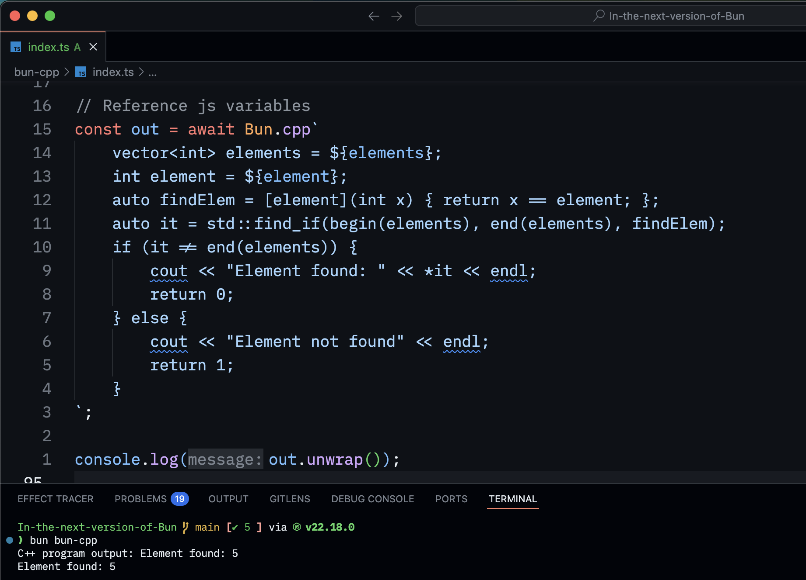

# Bun CPP

Demo tweet: https://x.com/notparbez/status/1960756444908716222

Run inline cpp code in Bun. Even reference js variables in it. This is inspired by https://x.com/ChShersh/status/1959166329337876483 tweet.

## Requirements

You must have a C++ compiler installed (like `g++` or `clang++`).

Author: [@notparbez](https://x.com/notparbez)
