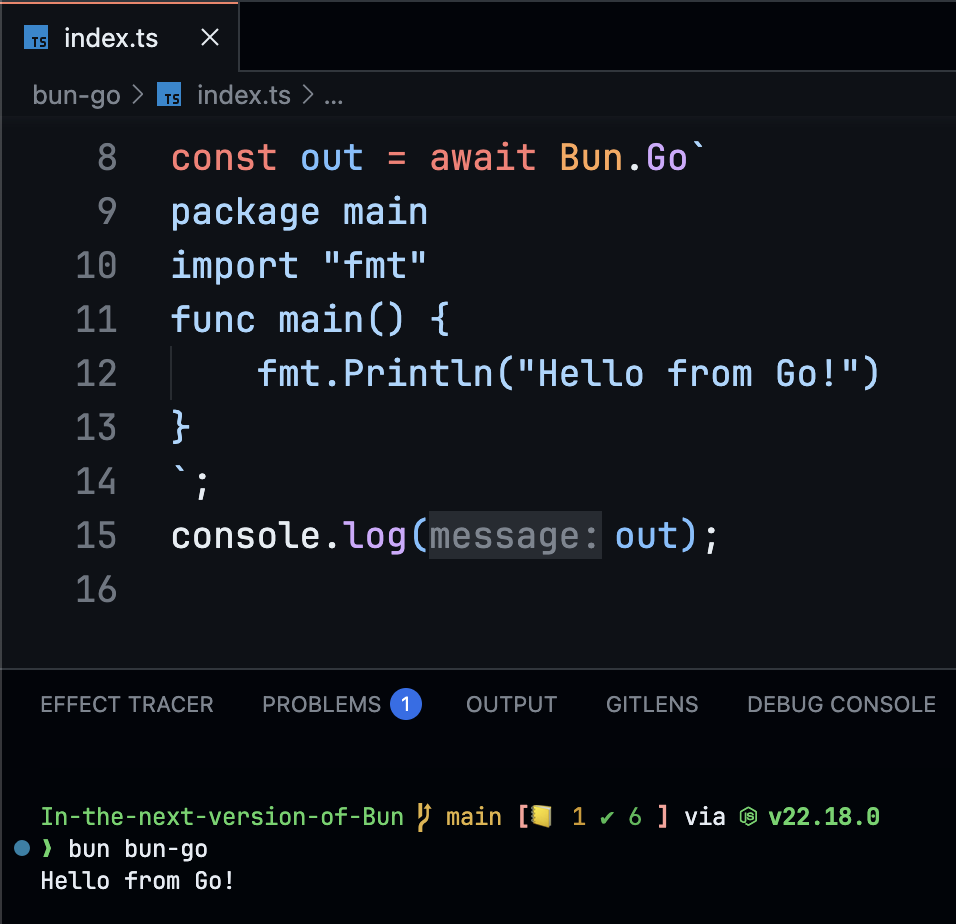

# Bun Go

Run inline go code in Bun. This is inspired by https://x.com/WolfYangFan/status/1959315842522300831 tweet.



## Requirements

You will need to have [Yaegi](https://github.com/traefik/yaegi/) installed. You can install it via:

```sh
go install github.com/traefik/yaegi/cmd/yaegi@latest
```

Author: [@notparbez](https://x.com/notparbez)
