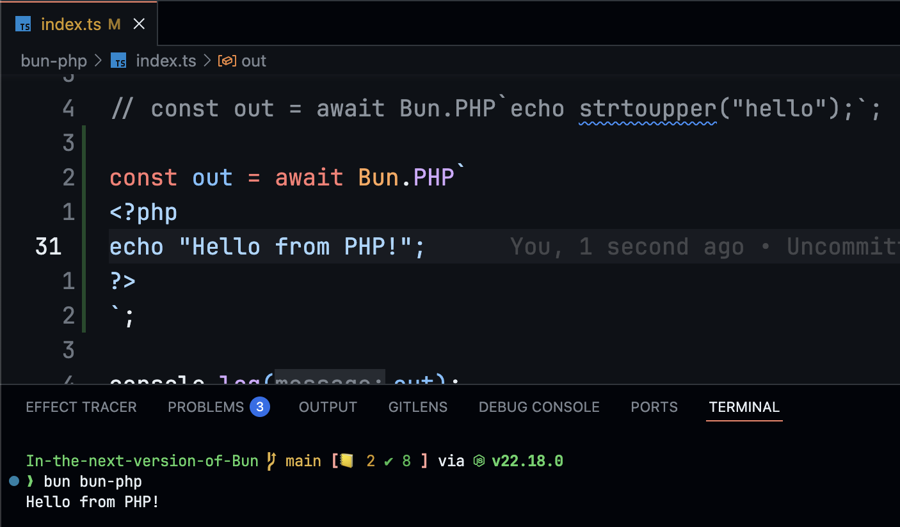

# Bun PHP

Demo tweet: https://x.com/notparbez/status/1960014598569865705

Run inline php code in Bun. This is inspired by https://x.com/thdxr/status/1958246871861715108 tweet.



## Requirements

You will need to have php installed. You can install it via:

```sh
brew install php
```

Author: [@notparbez](https://x.com/notparbez)
